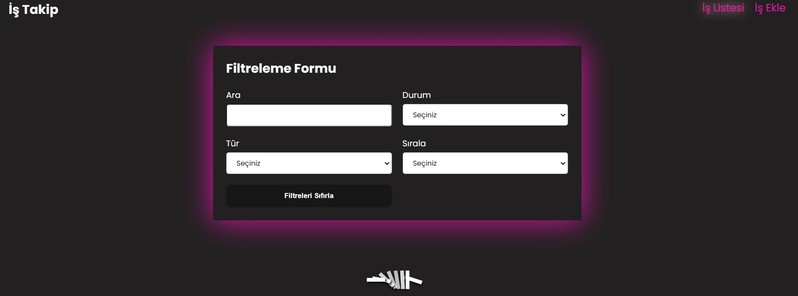
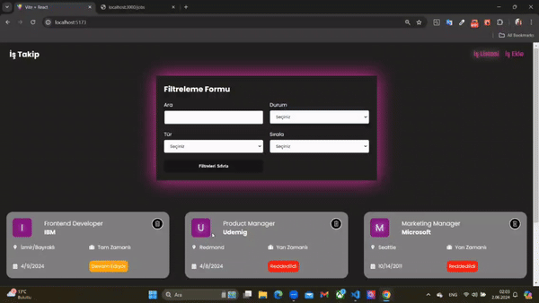

# Redux_JobApp_Project

A responsive and stylishly designed Job App, compatible with every screen, was created using React libraries to allow users to add jobs, track job status, filter by status and type, and remove jobs from the list, while also providing an opportunity to understand and implement the React Redux-Thunk structure through various developments.

# Tools and Libraries Used

-react-redux,
-@reduxjs/toolkit,
-json-server,
-bootstrap,
-react,
-react-bootstrap,
-react-dom,
-react-router-dom,
-react-icons,
-react-toastify,
-uuid,
-sass,
-axios,

# Screenshots

# Gif

